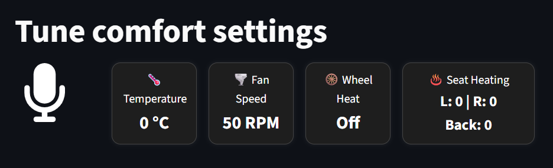

# AI Driving Concierge

A voice-controlled dashboard for managing car comfort settings using Streamlit and AI audio processing.

## Features

### Voice Control
- **Audio Recording**: Click to record voice commands for adjusting car settings
- **Real-time Processing**: AI processes audio commands and updates settings automatically

### Dashboard Display
The app displays a 2x2 grid of car comfort controls:

**Row 1:**
- **Temperature** - Current cabin temperature in °C
- **Fan Speed** - Current fan speed in RPM

**Row 2:**
- **Steering Wheel Heating** - On/Off status
- **Seat Heating** - Individual controls for Left (L), Right (R), and Back seats

## Installation

### Prerequisites
```bash
pip install -m requirements.txt
```

```bash
OPENAI_API_KEY = "your-api-key-here"
```
## Usage

1. **Start the application:**
   ```bash
   streamlit run app.py
   ```

2. **Use voice commands:**
   - Click the "Tune comfort settings" button to start recording
   - Speak the commands (e.g., "Set temperature to 22 degrees", "Decrease the fan speed by 10", "Turn on the steering wheel heating")
   - The AI will process your command and update the dashboard

## Configuration

### Session State Variables
The app manages these settings in Streamlit session state:

- `temperature`: Integer (°C)
- `fan_speed`: Integer (RPM)
- `steering_wheel_heating`: String ("On"/"Off")
- `seat_heating`: Dictionary with keys "L", "R", "Back" (each "On"/"Off")


## AI Integration

The `do_the_action()` function in `ai_utils.py` should:
1. Process the audio input (speech-to-text, intent recognition)
2. Update the appropriate `st.session_state` variables
3. Handle error cases and invalid commands


## UI Part

The frontend implementation is built with Streamlit, enhanced with custom CSS for styling and it looks like this:

  

